# Arc State Machine

*Generated: 2026-03-23T07:15:00.000Z*
*Sensor count: 80 (0 disabled) | Skill count: 113*

```mermaid
stateDiagram-v2
    [*] --> SystemdTimer: every 1 min

    state SystemdTimer {
        [*] --> SensorsService
        [*] --> DispatchService
    }

    state SensorsService {
        [*] --> RunAllSensors: parallel via Promise.allSettled
        RunAllSensors --> HealthSensors
        RunAllSensors --> FleetSensors
        RunAllSensors --> GitHubSensors
        RunAllSensors --> ContentSensors
        RunAllSensors --> DeFiSensors
        RunAllSensors --> AIBTCSensors
        RunAllSensors --> InfrastructureSensors
        RunAllSensors --> MemoryMaintenanceSensors
        RunAllSensors --> MonitoringSensors

        state HealthSensors {
            arc_alive_check
            arc_service_health
            systems_monitor
        }

        state FleetSensors {
            fleet_comms
            fleet_health
            fleet_memory
            fleet_self_sync
            fleet_push
            agent_hub
        }

        state GitHubSensors {
            github_issue_monitor
            github_mentions
            github_release_watcher
            github_security_alerts
            github_ci_status
            github_worker_logs
            arc0btc_pr_review
            arc0btc_security_audit
            aibtc_dev_ops
            aibtc_repo_maintenance
        }

        state ContentSensors {
            blog_publishing
            aibtc_news_editorial
            aibtc_news_deal_flow
            ordinals_market_data
            social_x_posting
            social_agent_engagement
            social_x_ecosystem
            arxiv_research
        }

        state DeFiSensors {
            defi_bitflow
            mempool_watch
            arc_payments
        }

        state AIBTCSensors {
            aibtc_heartbeat
            aibtc_inbox_sync
            aibtc_welcome
            erc8004_reputation
            erc8004_indexer
            erc8004_trust
            erc8004_validation
            arc_inbox
        }

        state InfrastructureSensors {
            alb
            arc_housekeeping
            arc_email_sync
            arc_ceo_review
            arc_ops_review
            context_review
            compliance_review
            worker_logs_monitor
        }

        state MemoryMaintenanceSensors {
            arc_architecture_review
            arc_blocked_review
            arc_catalog
            arc_cost_reporting
            arc_failure_triage
            arc_introspection
            arc_memory
            arc_reporting
            arc_reputation
            arc_strategy_review
            arc_workflow_review
            auto_queue
        }

        state MonitoringSensors {
            arc_monitoring_service
            arc_opensource
            arc0btc_site_health
            arc0btc_services
            arc_self_review
        }

        HealthSensors --> TaskQueue: queue if signal detected
        FleetSensors --> TaskQueue
        GitHubSensors --> TaskQueue
        ContentSensors --> TaskQueue
        DeFiSensors --> TaskQueue
        AIBTCSensors --> TaskQueue
        InfrastructureSensors --> TaskQueue
        MemoryMaintenanceSensors --> TaskQueue
        MonitoringSensors --> TaskQueue
    }

    state DispatchService {
        [*] --> CheckShutdown
        CheckShutdown --> [*]: shutdown flag set
        CheckShutdown --> CheckLock

        CheckLock --> [*]: lock held by live PID
        CheckLock --> CheckGate

        CheckGate --> [*]: gate closed (rate limit / auth failure)
        CheckGate --> SelectTask

        SelectTask --> [*]: no pending tasks
        SelectTask --> PreFlightCheck

        state PreFlightCheck {
            [*] --> CheckDailyCap
            CheckDailyCap --> CheckLandingPageGate: cap OK or P1/P2
            CheckDailyCap --> DeferTask: >$500/day AND P3+
            CheckLandingPageGate --> AutoClose: subject matches landing-page pattern
            CheckLandingPageGate --> CheckGitHubRoute: not landing-page
            CheckGitHubRoute --> RouteToArc: GitHub task on worker
            CheckGitHubRoute --> ModelGate: not GitHub
            ModelGate --> RejectTask: no model set (Claude tasks)
            ModelGate --> BuildPrompt: model set
        }

        PreFlightCheck --> BuildPrompt

        state BuildPrompt {
            [*] --> LoadSOUL
            LoadSOUL --> LoadCLAUDE
            LoadCLAUDE --> LoadMEMORY
            LoadMEMORY --> LoadFleetKnowledge
            LoadFleetKnowledge --> LoadSkillContext
            LoadSkillContext --> LoadTaskSubject
            LoadTaskSubject --> [*]
        }

        BuildPrompt --> ModelRoute

        state ModelRoute {
            [*] --> ReadTaskModel
            ReadTaskModel --> OpusTier: model=opus (explicit)
            ReadTaskModel --> SonnetTier: model=sonnet (explicit)
            ReadTaskModel --> HaikuTier: model=haiku (explicit)
            ReadTaskModel --> CodexRoute: model=codex/*
            ReadTaskModel --> OpenRouterRoute: model=openrouter/*
        }

        state OpusTier {
            timeout_30min
            note: deep work
        }

        state SonnetTier {
            timeout_15min
            note: composition
        }

        state HaikuTier {
            timeout_5min
            note: simple exec
        }

        ModelRoute --> WorktreeCheck

        state WorktreeCheck {
            [*] --> HasWorktreeSkill
            HasWorktreeSkill --> CreateWorktree: arc-worktrees skill
            HasWorktreeSkill --> RunInPlace: no worktree skill
            CreateWorktree --> ClaudeSubprocess
            RunInPlace --> ClaudeSubprocess
        }

        WorktreeCheck --> ClaudeSubprocess

        state ClaudeSubprocess {
            [*] --> StreamJSON
            StreamJSON --> ParseResult
            ParseResult --> ExtractCost
            ExtractCost --> [*]
        }

        ClaudeSubprocess --> PostDispatch

        state PostDispatch {
            [*] --> RecordCycleLog
            RecordCycleLog --> RecordQuality
            RecordQuality --> SafeCommit
            SafeCommit --> SyntaxGuard: staged .ts files
            SyntaxGuard --> PostCommitHealth: syntax OK
            SyntaxGuard --> BlockCommit: syntax error → follow-up task
            PostCommitHealth --> ValidateServices
            ValidateServices --> MergeWorktree: worktree path
            ValidateServices --> UpdateFleetStatus: in-place path
            MergeWorktree --> UpdateFleetStatus: validate OK
            MergeWorktree --> DiscardWorktree: validate failed
            UpdateFleetStatus --> RecordGateSuccess
            RecordGateSuccess --> [*]
        }

        PostDispatch --> LearningCheck

        state LearningCheck {
            [*] --> CheckCriteria
            CheckCriteria --> SpawnRetrospective: P1 task OR cost >$1
            CheckCriteria --> KeywordScan: completed, below threshold
            KeywordScan --> SpawnLearningExtraction: discovery keywords matched (P8/Haiku)
            KeywordScan --> [*]: no keywords matched
            SpawnRetrospective --> [*]
            SpawnLearningExtraction --> [*]
        }
    }

    state TaskQueue {
        pending --> active: dispatch selects
        active --> completed: success
        active --> failed: error / max retries / no model set
        active --> blocked: unresolvable dependency
        failed --> pending: retry (max 3)
        blocked --> [*]: human intervention
    }

    TaskQueue --> DispatchService
    SensorsService --> TaskQueue
```

## Sensor Count by Category (2026-03-23, cycle 3)

| Category | Count |
|----------|-------|
| Memory/Maintenance | 12 |
| GitHub/PR | 10 |
| Content/Publishing | 8 |
| AIBTC/ERC-8004 | 8 |
| Fleet | 6 |
| Infrastructure | 8 |
| DeFi | 3 |
| Health/Monitoring | 8 |
| Other | 17 |
| **Total** | **80** |

## Key Architectural Changes (8bc2945 → 669d781)

| Change | Impact |
|--------|--------|
| `refactor(dispatch): remove 3-tier model routing` (451c438d) | Implicit priority→model fallback removed. Tasks without `model` column are rejected at dispatch with `status=failed`. Priority = urgency; model = capability. Both must be set independently. |
| `fix(sensors): add missing model field to 4 sensors` (b0945b0d) | github-release-watcher, arc-opensource, arc-ops-review, arc-memory now set model explicitly. Previously tasks from these sensors failed at dispatch. |
| `fix(ordinals-market-data): add cooldown pre-check` (580003b6) | Hook-state cooldown checked before queuing signal tasks. Prevents duplicate signals within 60-min window. |
| `fix(aibtc-welcome): harden isRelayHealthy()` (2b3b2397) | Stops self-heal loop — relay health check no longer re-triggers NONCE_CONFLICT recovery cycle. |
