# Arc State Machine

*Generated: 2026-03-20T07:10:00.000Z*
*Sensor count: 88 (1 disabled) | Skill count: 121*

```mermaid
stateDiagram-v2
    [*] --> SystemdTimer: every 1 min

    state SystemdTimer {
        [*] --> SensorsService
        [*] --> DispatchService
    }

    state SensorsService {
        [*] --> RunAllSensors: parallel via Promise.allSettled
        RunAllSensors --> HealthSensors
        RunAllSensors --> FleetSensors
        RunAllSensors --> GitHubSensors
        RunAllSensors --> ContentSensors
        RunAllSensors --> DeFiSensors
        RunAllSensors --> AIBTCSensors
        RunAllSensors --> InfrastructureSensors
        RunAllSensors --> MemoryMaintenanceSensors
        RunAllSensors --> MonitoringSensors

        state HealthSensors {
            arc_alive_check
            arc_service_health
            systems_monitor
        }

        state FleetSensors {
            fleet_comms
            fleet_health
            fleet_memory
            fleet_self_sync
            fleet_push
            agent_hub
        }

        state GitHubSensors {
            github_issue_monitor
            github_mentions
            github_release_watcher
            github_security_alerts
            github_ci_status
            github_worker_logs
            arc0btc_pr_review
            arc0btc_security_audit
            aibtc_dev_ops
            aibtc_repo_maintenance
        }

        state ContentSensors {
            blog_publishing
            aibtc_news_editorial
            aibtc_news_deal_flow
            ordinals_market_data
            social_x_posting
            social_agent_engagement
            social_x_ecosystem
            arxiv_research
        }

        state DeFiSensors {
            defi_bitflow
            defi_compounding
            mempool_watch
            arc_payments
        }

        state AIBTCSensors {
            aibtc_heartbeat
            aibtc_inbox_sync
            aibtc_welcome
            erc8004_reputation
            erc8004_indexer
            erc8004_trust
            erc8004_validation
            arc_inbox
        }

        state InfrastructureSensors {
            alb
            arc_bounty_scanner
            arc_housekeeping
            arc_email_sync
            arc_ceo_review
            arc_ops_review
            context_review
            compliance_review
            worker_logs_monitor
        }

        state MemoryMaintenanceSensors {
            arc_architecture_review
            arc_blocked_review
            arc_catalog
            arc_cost_reporting
            arc_dispatch_eval
            arc_failure_triage
            arc_introspection
            arc_memory
            arc_reporting
            arc_reputation
            arc_strategy_review
            arc_workflow_review
            auto_queue
            skill_effectiveness
        }

        state MonitoringSensors {
            arc_monitoring_service
            arc_opensource
            arc0btc_site_health
            arc0btc_services
        }

        HealthSensors --> TaskQueue: queue if signal detected
        FleetSensors --> TaskQueue
        GitHubSensors --> TaskQueue
        ContentSensors --> TaskQueue
        DeFiSensors --> TaskQueue
        AIBTCSensors --> TaskQueue
        InfrastructureSensors --> TaskQueue
        MemoryMaintenanceSensors --> TaskQueue
        MonitoringSensors --> TaskQueue
    }

    state DispatchService {
        [*] --> CheckShutdown
        CheckShutdown --> [*]: shutdown flag set
        CheckShutdown --> CheckLock

        CheckLock --> [*]: lock held by live PID
        CheckLock --> CheckGate

        CheckGate --> [*]: gate closed (rate limit / auth failure)
        CheckGate --> SelectTask

        SelectTask --> [*]: no pending tasks
        SelectTask --> PreFlightCheck

        state PreFlightCheck {
            [*] --> CheckDailyCap
            CheckDailyCap --> CheckLandingPageGate: cap OK or P1/P2
            CheckDailyCap --> DeferTask: >$500/day AND P3+
            CheckLandingPageGate --> AutoClose: subject matches landing-page pattern
            CheckLandingPageGate --> CheckGitHubRoute: not landing-page
            CheckGitHubRoute --> RouteToArc: GitHub task on worker
            CheckGitHubRoute --> ModelRoute: not GitHub
        }

        PreFlightCheck --> BuildPrompt

        state BuildPrompt {
            [*] --> LoadSOUL
            LoadSOUL --> LoadCLAUDE
            LoadCLAUDE --> LoadMEMORY
            LoadMEMORY --> LoadFleetKnowledge
            LoadFleetKnowledge --> LoadSkillContext
            LoadSkillContext --> LoadTaskSubject
            LoadTaskSubject --> [*]
        }

        BuildPrompt --> ModelRoute

        state ModelRoute {
            [*] --> CheckTaskModel
            CheckTaskModel --> OpusTier: P1-4 (senior)
            CheckTaskModel --> SonnetTier: P5-7 (mid)
            CheckTaskModel --> HaikuTier: P8+ (junior)
            CheckTaskModel --> CodexRoute: model=codex/*
            CheckTaskModel --> OpenRouterRoute: model=openrouter/*
        }

        state OpusTier {
            timeout_30min
            note: P1→Opus 4.6, deep work
        }

        state SonnetTier {
            timeout_15min
            note: P5-7→Sonnet 4.6, composition
        }

        state HaikuTier {
            timeout_5min
            note: P8+→Haiku 4.5, simple exec
        }

        ModelRoute --> WorktreeCheck

        state WorktreeCheck {
            [*] --> HasWorktreeSkill
            HasWorktreeSkill --> CreateWorktree: arc-worktrees skill
            HasWorktreeSkill --> RunInPlace: no worktree skill
            CreateWorktree --> ClaudeSubprocess
            RunInPlace --> ClaudeSubprocess
        }

        WorktreeCheck --> ClaudeSubprocess

        state ClaudeSubprocess {
            [*] --> StreamJSON
            StreamJSON --> ParseResult
            ParseResult --> ExtractCost
            ExtractCost --> [*]
        }

        ClaudeSubprocess --> PostDispatch

        state PostDispatch {
            [*] --> RecordCycleLog
            RecordCycleLog --> RecordQuality
            RecordQuality --> SafeCommit
            SafeCommit --> SyntaxGuard: staged .ts files
            SyntaxGuard --> PostCommitHealth: syntax OK
            SyntaxGuard --> BlockCommit: syntax error → follow-up task
            PostCommitHealth --> ValidateServices
            ValidateServices --> MergeWorktree: worktree path
            ValidateServices --> UpdateFleetStatus: in-place path
            MergeWorktree --> UpdateFleetStatus: validate OK
            MergeWorktree --> DiscardWorktree: validate failed
            UpdateFleetStatus --> RecordGateSuccess
            RecordGateSuccess --> [*]
        }

        PostDispatch --> LearningCheck

        state LearningCheck {
            [*] --> CheckCriteria
            CheckCriteria --> SpawnRetrospective: P1 task OR cost >$1
            CheckCriteria --> KeywordScan: completed, below threshold
            KeywordScan --> SpawnLearningExtraction: discovery keywords matched (P8/Haiku)
            KeywordScan --> [*]: no keywords matched
            SpawnRetrospective --> [*]
            SpawnLearningExtraction --> [*]
        }
    }

    state TaskQueue {
        pending --> active: dispatch selects
        active --> completed: success
        active --> failed: error / max retries
        active --> blocked: unresolvable dependency
        failed --> pending: retry (max 3)
        blocked --> [*]: human intervention
    }

    TaskQueue --> DispatchService
    SensorsService --> TaskQueue
```

## Sensor Count by Category (2026-03-20, updated)

| Category | Count |
|----------|-------|
| Memory/Maintenance | 14 |
| GitHub/PR | 10 |
| Content/Publishing | 8 |
| AIBTC/ERC-8004 | 8 |
| Fleet | 6 |
| Infrastructure | 9 |
| DeFi | 4 |
| Health/Monitoring | 7 |
| Other | 22 |
| **Total** | **88** |

## Key Architectural Changes (ea9d04c → 8191198)

| Change | Impact |
|--------|--------|
| Landing-page gate in `dispatch.ts` | Auto-closes `[landing-page]` tasks before Claude subprocess — saves Sonnet budget on human-handled tasks |
| `ordinals-market-data` sensor added | New competition signal source: inscriptions, BRC-20, NFT floors, fee market. ContentSensors +1 |
| `arc-bounty-scanner` sensor added | Scans AIBTC GitHub for funded bounty issues as D1 revenue opportunities. InfrastructureSensors +1 |
| `defi-bitflow` threshold 5%→15%, rate 240→720min | Reduces sBTC/STX signal flooding during $100K competition window |
| `github-mentions` PR noise gate + dedup | Prevents duplicate tasks on completed PR reviews; one reaction per review cycle |
| `github-issue-monitor` wires implementation state machine | More structured issue triage |
| `arc-cost-reporting` sensor 60min → 1440min | Cost reports daily (not hourly); reduces low-value sensor noise |
| `mcp-server` HTTP auth + CORS restricted | Security hardening post v1.41.0 integration review (#7596) |
| `effort` frontmatter on 36 skills | Documentation-only (not consumed by dispatch); potential future model-routing signal |
