# Arc State Machine

*Generated: 2026-02-28T18:38:56.591Z*

```mermaid
stateDiagram-v2
    [*] --> SystemdTimer: every 1 min

    state SystemdTimer {
        [*] --> SensorsService
        [*] --> DispatchService
    }

    state SensorsService {
        [*] --> RunAllSensors: parallel via Promise.allSettled
        RunAllSensors --> aibtc_heartbeatSensor: aibtc-heartbeat
        RunAllSensors --> aibtc_inboxSensor: aibtc-inbox
        RunAllSensors --> aibtc_maintenanceSensor: aibtc-maintenance
        RunAllSensors --> aibtc_newsSensor: aibtc-news
        RunAllSensors --> architectSensor: architect
        RunAllSensors --> blog_publishingSensor: blog-publishing
        RunAllSensors --> ceo_reviewSensor: ceo-review
        RunAllSensors --> ci_statusSensor: ci-status
        RunAllSensors --> cost_alertingSensor: cost-alerting
        RunAllSensors --> emailSensor: email
        RunAllSensors --> failure_triageSensor: failure-triage
        RunAllSensors --> github_mentionsSensor: github-mentions
        RunAllSensors --> healthSensor: health
        RunAllSensors --> heartbeatSensor: heartbeat
        RunAllSensors --> housekeepingSensor: housekeeping
        RunAllSensors --> manage_skillsSensor: manage-skills
        RunAllSensors --> overnight_briefSensor: overnight-brief
        RunAllSensors --> release_watcherSensor: release-watcher
        RunAllSensors --> report_emailSensor: report-email
        RunAllSensors --> security_alertsSensor: security-alerts
        RunAllSensors --> status_reportSensor: status-report
        RunAllSensors --> worker_logsSensor: worker-logs

        state aibtc_heartbeatSensor {
            [*] --> aibtc_heartbeatGate: claimSensorRun(aibtc-heartbeat)
            aibtc_heartbeatGate --> aibtc_heartbeatSkip: interval not elapsed
            aibtc_heartbeatGate --> aibtc_heartbeatDedup: interval elapsed
            aibtc_heartbeatDedup --> aibtc_heartbeatSkip: pending task exists
            aibtc_heartbeatDedup --> aibtc_heartbeatCreateTask: no dupe
            aibtc_heartbeatCreateTask --> [*]: insertTask()
            aibtc_heartbeatSkip --> [*]: return skip
        }

        state aibtc_inboxSensor {
            [*] --> aibtc_inboxGate: claimSensorRun(aibtc-inbox)
            aibtc_inboxGate --> aibtc_inboxSkip: interval not elapsed
            aibtc_inboxGate --> aibtc_inboxDedup: interval elapsed
            aibtc_inboxDedup --> aibtc_inboxSkip: pending task exists
            aibtc_inboxDedup --> aibtc_inboxCreateTask: no dupe
            aibtc_inboxCreateTask --> [*]: insertTask()
            aibtc_inboxSkip --> [*]: return skip
        }

        state aibtc_maintenanceSensor {
            [*] --> aibtc_maintenanceGate: claimSensorRun(aibtc-maintenance)
            aibtc_maintenanceGate --> aibtc_maintenanceSkip: interval not elapsed
            aibtc_maintenanceGate --> aibtc_maintenanceDedup: interval elapsed
            aibtc_maintenanceDedup --> aibtc_maintenanceSkip: pending task exists
            aibtc_maintenanceDedup --> aibtc_maintenanceCreateTask: no dupe
            aibtc_maintenanceCreateTask --> [*]: insertTask()
            aibtc_maintenanceSkip --> [*]: return skip
        }

        state aibtc_newsSensor {
            [*] --> aibtc_newsGate: claimSensorRun(aibtc-news)
            aibtc_newsGate --> aibtc_newsSkip: interval not elapsed
            aibtc_newsGate --> aibtc_newsDedup: interval elapsed
            aibtc_newsDedup --> aibtc_newsSkip: pending task exists
            aibtc_newsDedup --> aibtc_newsCreateTask: no dupe
            aibtc_newsCreateTask --> [*]: insertTask()
            aibtc_newsSkip --> [*]: return skip
        }

        state architectSensor {
            [*] --> architectGate: claimSensorRun(architect)
            architectGate --> architectSkip: interval not elapsed
            architectGate --> architectDedup: interval elapsed
            architectDedup --> architectSkip: pending task exists
            architectDedup --> architectCreateTask: no dupe
            architectCreateTask --> [*]: insertTask()
            architectSkip --> [*]: return skip
        }

        state blog_publishingSensor {
            [*] --> blog_publishingGate: claimSensorRun(blog-publishing)
            blog_publishingGate --> blog_publishingSkip: interval not elapsed
            blog_publishingGate --> blog_publishingDedup: interval elapsed
            blog_publishingDedup --> blog_publishingSkip: pending task exists
            blog_publishingDedup --> blog_publishingCreateTask: no dupe
            blog_publishingCreateTask --> [*]: insertTask()
            blog_publishingSkip --> [*]: return skip
        }

        state ceo_reviewSensor {
            [*] --> ceo_reviewGate: claimSensorRun(ceo-review)
            ceo_reviewGate --> ceo_reviewSkip: interval not elapsed
            ceo_reviewGate --> ceo_reviewDedup: interval elapsed
            ceo_reviewDedup --> ceo_reviewSkip: pending task exists
            ceo_reviewDedup --> ceo_reviewCreateTask: no dupe
            ceo_reviewCreateTask --> [*]: insertTask()
            ceo_reviewSkip --> [*]: return skip
        }

        state ci_statusSensor {
            [*] --> ci_statusGate: claimSensorRun(ci-status)
            ci_statusGate --> ci_statusSkip: interval not elapsed
            ci_statusGate --> ci_statusDedup: interval elapsed
            ci_statusDedup --> ci_statusSkip: pending task exists
            ci_statusDedup --> ci_statusCreateTask: no dupe
            ci_statusCreateTask --> [*]: insertTask()
            ci_statusSkip --> [*]: return skip
        }

        state cost_alertingSensor {
            [*] --> cost_alertingGate: claimSensorRun(cost-alerting)
            cost_alertingGate --> cost_alertingSkip: interval not elapsed
            cost_alertingGate --> cost_alertingDedup: interval elapsed
            cost_alertingDedup --> cost_alertingSkip: pending task exists
            cost_alertingDedup --> cost_alertingCreateTask: no dupe
            cost_alertingCreateTask --> [*]: insertTask()
            cost_alertingSkip --> [*]: return skip
        }

        state emailSensor {
            [*] --> emailGate: claimSensorRun(email)
            emailGate --> emailSkip: interval not elapsed
            emailGate --> emailDedup: interval elapsed
            emailDedup --> emailSkip: pending task exists
            emailDedup --> emailCreateTask: no dupe
            emailCreateTask --> [*]: insertTask()
            emailSkip --> [*]: return skip
        }

        state failure_triageSensor {
            [*] --> failure_triageGate: claimSensorRun(failure-triage)
            failure_triageGate --> failure_triageSkip: interval not elapsed
            failure_triageGate --> failure_triageDedup: interval elapsed
            failure_triageDedup --> failure_triageSkip: pending task exists
            failure_triageDedup --> failure_triageCreateTask: no dupe
            failure_triageCreateTask --> [*]: insertTask()
            failure_triageSkip --> [*]: return skip
        }

        state github_mentionsSensor {
            [*] --> github_mentionsGate: claimSensorRun(github-mentions)
            github_mentionsGate --> github_mentionsSkip: interval not elapsed
            github_mentionsGate --> github_mentionsDedup: interval elapsed
            github_mentionsDedup --> github_mentionsSkip: pending task exists
            github_mentionsDedup --> github_mentionsCreateTask: no dupe
            github_mentionsCreateTask --> [*]: insertTask()
            github_mentionsSkip --> [*]: return skip
        }

        state healthSensor {
            [*] --> healthGate: claimSensorRun(health)
            healthGate --> healthSkip: interval not elapsed
            healthGate --> healthDedup: interval elapsed
            healthDedup --> healthSkip: pending task exists
            healthDedup --> healthCreateTask: no dupe
            healthCreateTask --> [*]: insertTask()
            healthSkip --> [*]: return skip
        }

        state heartbeatSensor {
            [*] --> heartbeatGate: claimSensorRun(heartbeat)
            heartbeatGate --> heartbeatSkip: interval not elapsed
            heartbeatGate --> heartbeatDedup: interval elapsed
            heartbeatDedup --> heartbeatSkip: pending task exists
            heartbeatDedup --> heartbeatCreateTask: no dupe
            heartbeatCreateTask --> [*]: insertTask()
            heartbeatSkip --> [*]: return skip
        }

        state housekeepingSensor {
            [*] --> housekeepingGate: claimSensorRun(housekeeping)
            housekeepingGate --> housekeepingSkip: interval not elapsed
            housekeepingGate --> housekeepingDedup: interval elapsed
            housekeepingDedup --> housekeepingSkip: pending task exists
            housekeepingDedup --> housekeepingCreateTask: no dupe
            housekeepingCreateTask --> [*]: insertTask()
            housekeepingSkip --> [*]: return skip
        }

        state manage_skillsSensor {
            [*] --> manage_skillsGate: claimSensorRun(manage-skills)
            manage_skillsGate --> manage_skillsSkip: interval not elapsed
            manage_skillsGate --> manage_skillsDedup: interval elapsed
            manage_skillsDedup --> manage_skillsSkip: pending task exists
            manage_skillsDedup --> manage_skillsCreateTask: no dupe
            manage_skillsCreateTask --> [*]: insertTask()
            manage_skillsSkip --> [*]: return skip
        }

        state overnight_briefSensor {
            [*] --> overnight_briefGate: claimSensorRun(overnight-brief)
            overnight_briefGate --> overnight_briefSkip: interval not elapsed
            overnight_briefGate --> overnight_briefDedup: interval elapsed
            overnight_briefDedup --> overnight_briefSkip: pending task exists
            overnight_briefDedup --> overnight_briefCreateTask: no dupe
            overnight_briefCreateTask --> [*]: insertTask()
            overnight_briefSkip --> [*]: return skip
        }

        state release_watcherSensor {
            [*] --> release_watcherGate: claimSensorRun(release-watcher)
            release_watcherGate --> release_watcherSkip: interval not elapsed
            release_watcherGate --> release_watcherDedup: interval elapsed
            release_watcherDedup --> release_watcherSkip: pending task exists
            release_watcherDedup --> release_watcherCreateTask: no dupe
            release_watcherCreateTask --> [*]: insertTask()
            release_watcherSkip --> [*]: return skip
        }

        state report_emailSensor {
            [*] --> report_emailGate: claimSensorRun(report-email)
            report_emailGate --> report_emailSkip: interval not elapsed
            report_emailGate --> report_emailDedup: interval elapsed
            report_emailDedup --> report_emailSkip: pending task exists
            report_emailDedup --> report_emailCreateTask: no dupe
            report_emailCreateTask --> [*]: insertTask()
            report_emailSkip --> [*]: return skip
        }

        state security_alertsSensor {
            [*] --> security_alertsGate: claimSensorRun(security-alerts)
            security_alertsGate --> security_alertsSkip: interval not elapsed
            security_alertsGate --> security_alertsDedup: interval elapsed
            security_alertsDedup --> security_alertsSkip: pending task exists
            security_alertsDedup --> security_alertsCreateTask: no dupe
            security_alertsCreateTask --> [*]: insertTask()
            security_alertsSkip --> [*]: return skip
        }

        state status_reportSensor {
            [*] --> status_reportGate: claimSensorRun(status-report)
            status_reportGate --> status_reportSkip: interval not elapsed
            status_reportGate --> status_reportDedup: interval elapsed
            status_reportDedup --> status_reportSkip: pending task exists
            status_reportDedup --> status_reportCreateTask: no dupe
            status_reportCreateTask --> [*]: insertTask()
            status_reportSkip --> [*]: return skip
        }

        state worker_logsSensor {
            [*] --> worker_logsGate: claimSensorRun(worker-logs)
            worker_logsGate --> worker_logsSkip: interval not elapsed
            worker_logsGate --> worker_logsDedup: interval elapsed
            worker_logsDedup --> worker_logsSkip: pending task exists
            worker_logsDedup --> worker_logsCreateTask: no dupe
            worker_logsCreateTask --> [*]: insertTask()
            worker_logsSkip --> [*]: return skip
        }

    }

    state DispatchService {
        [*] --> CheckLock: db/dispatch-lock.json
        CheckLock --> Exit: lock held by live PID
        CheckLock --> CrashRecovery: lock held by dead PID
        CheckLock --> PickTask: no lock
        CrashRecovery --> PickTask: mark stale active tasks failed
        PickTask --> Idle: no pending tasks
        PickTask --> BuildPrompt: highest priority task

        state BuildPrompt {
            [*] --> LoadCore: SOUL.md + CLAUDE.md + MEMORY.md
            LoadCore --> LoadSkills: task.skills JSON array
            LoadSkills --> LoadSkillMd: for each skill name
            LoadSkillMd --> AssemblePrompt: SKILL.md content
            note right of LoadSkillMd: Only SKILL.md loaded\nAGENT.md stays for subagents
        }

        BuildPrompt --> WriteLock: markTaskActive()
        WriteLock --> SpawnClaude: claude --print --verbose
        SpawnClaude --> ParseResult: stream-json output
        ParseResult --> CheckSelfClose: task still active?
        CheckSelfClose --> RecordCost: LLM called arc tasks close
        CheckSelfClose --> FallbackClose: fallback markTaskCompleted
        FallbackClose --> RecordCost
        RecordCost --> ClearLock
        ClearLock --> AutoCommit: git add memory/ skills/ src/ templates/
        AutoCommit --> [*]
    }

    state CLI {
        [*] --> ArcCommand: arc <subcommand>
        ArcCommand --> TasksCRUD: tasks add/close/list
        ArcCommand --> SkillsRun: skills run --name X
        ArcCommand --> ManualDispatch: run
        ArcCommand --> StatusView: status
    }

    note right of CLI
        Skills with CLI:
        - aibtc-maintenance
        - aibtc-news
        - architect
        - blog-publishing
        - credentials
        - dashboard
        - email
        - failure-triage
        - housekeeping
        - manage-skills
        - research
        - wallet
        - worker-logs
    end note
```

## Decision Points

| # | Point | Context Available | Gate |
|---|-------|-------------------|------|
| 1 | Sensor fires | Hook state (interval check) | `claimSensorRun()` |
| 2 | Sensor creates task | External data + dedup check | `pendingTaskExistsForSource()` |
| 3 | Dispatch lock check | Lock file (PID + task_id) | `isPidAlive()` |
| 4 | Task selection | All pending tasks sorted | Priority ASC, ID ASC |
| 5 | Skill loading | `task.skills` JSON array | SKILL.md existence |
| 6 | Prompt assembly | SOUL + CLAUDE + MEMORY + skills | Token budget ~40-50k |
| 7 | LLM execution | Full prompt + CLI access | `arc` commands only |
| 8 | Result handling | Task status check post-run | Self-close vs fallback |
| 9 | Auto-commit | Staged dirs: memory/ skills/ src/ templates/ | `git diff --cached` |

## Skills Inventory

| Skill | Sensor | CLI | Agent | Description |
|-------|--------|-----|-------|-------------|
| aibtc-heartbeat | yes | - | - | Signed AIBTC platform check-in every 5 minutes via BIP-137 Bitcoin message signing |
| aibtc-inbox | yes | - | yes | Poll AIBTC platform inbox, sync messages locally, queue tasks for unread messages |
| aibtc-maintenance | yes | yes | yes | Triage, review, test, and support aibtcdev repos we depend on |
| aibtc-news | yes | yes | yes | File intelligence signals, claim editorial beats, track correspondent activity on aibtc.news |
| architect | yes | yes | yes | Continuous architecture review, state machine diagrams, and simplification via SpaceX 5-step process |
| blog-publishing | yes | yes | yes | Create, manage, and publish blog posts with ISO8601 content pattern |
| ceo | - | - | yes | Strategic operating manual — treat yourself as CEO of a one-entity company |
| ceo-review | yes | - | yes | CEO reviews the latest watch report and actively manages the task queue |
| ci-status | yes | - | - | Monitors GitHub Actions CI runs on our PRs and detects failures |
| cost-alerting | yes | - | - | Monitor daily spend and alert when thresholds are exceeded |
| credentials | - | yes | yes | Encrypted credential store for API keys, tokens, and secrets used by other skills |
| dashboard | - | yes | yes | Arc's live web dashboard — real-time task feed, sensor status, cost tracking |
| email | yes | yes | yes | Sync email from arc-email-worker, detect unread messages, read and send email |
| failure-triage | yes | yes | yes | Detect recurring failure patterns, escalate to investigation instead of retry |
| github-mentions | yes | - | - | Detects GitHub @mentions, review requests, and assignments via notifications API |
| health | yes | - | - | System health monitor — detects stale cycles and stuck dispatch |
| heartbeat | yes | - | - | Periodic system-alive task creator |
| housekeeping | yes | yes | yes | Periodic repo hygiene checks — uncommitted changes, stale locks, WAL size, memory bloat, file archival |
| manage-skills | yes | yes | yes | Create, inspect, and manage agent skills |
| overnight-brief | yes | - | yes | Generate a consolidated overnight brief at 6am PST covering all activity from 8pm–6am |
| release-watcher | yes | - | - | Detects new releases on watched repos and creates review tasks |
| report-email | yes | - | - | Email watch reports when new ones are generated |
| research | - | yes | yes | Process batches of links into mission-relevant research reports |
| security-alerts | yes | - | - | Monitor dependabot security alerts on repos we maintain |
| status-report | yes | - | yes | Generate watch reports (4-hour) summarizing all agent activity |
| wallet | - | yes | yes | Wallet management and cryptographic signing for Stacks and Bitcoin — unlock, lock, info, status, BTC/Stacks message signing, and BTC signature verification. |
| worker-logs | yes | yes | yes | Sync worker-logs forks, monitor production events, report trends |
